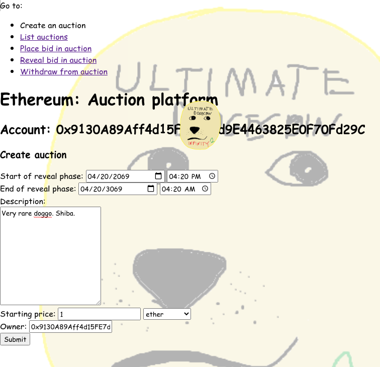
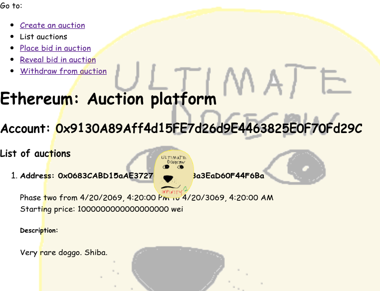
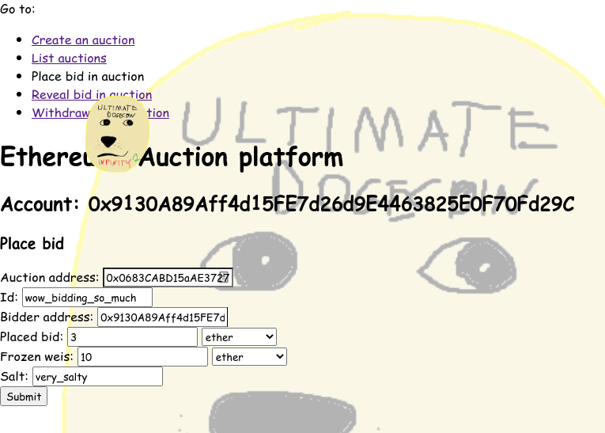
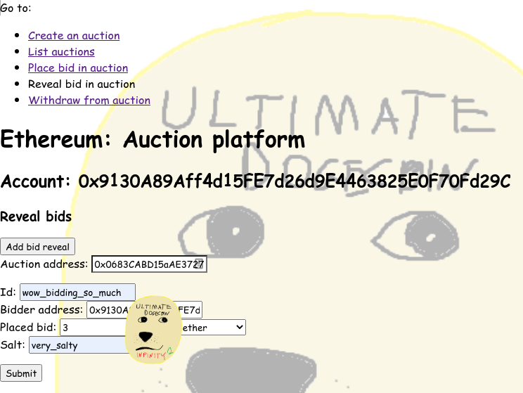
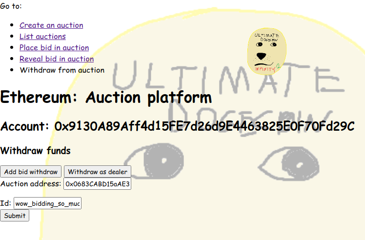

# Ethereum: Auction platform - Dokumentacja

## Wstęp

Przedstawiamy aplikację obsługującą aukcję drugiej ceny na blockchainie Ethereum.
Składa się ona ze smart kontraktu aukcji oraz aplikacji po stronie klienta umożliwiającej
tworzenie aukcji i branie w nich udziału.
Wszystkie smart kontrakty zawarte w projekcie zostały zaimplementowane
w języku Solidity, natomiast aplikacja po stronie klienta jest
oparta o JavaScript i HTML.

Specyfikacja:

-   użytkownik jest w stanie utworzyć aukcję drugiej ceny poprzez dostarczenie
    ceny startowej, terminów kolejnych faz aukcji oraz opisu przedmiotu/usługi, którą sprzedaje
-   dla danej aukcji użytkownik jest w stanie zgłosić swoją cenę poprzez
    odpowiednie postępowanie w kolejnych fazach aukcji
-   po zakończeniu aukcji jej właściciel może odebrać zapłatę od zwycięzcy, natomiast gracze
    mogą odzyskać swoje zablokowane na kontrakcie pieniądze

## Aukcja drugiej ceny na blockchainie

W aukcji drugiej ceny uczestnicy aukcji jednocześnie zgłaszają swoje
odzywki. Zwycięzcą takiej aukcji zostaje gracz, który zgłosił największą
odzywkę, spośród tych którzy przekroczyli cenę startową ustaloną przez
operatora aukcji.
Zapłata zwycięzcy wynosi maksimum z ceny startowej
oraz drugiej największej odzywki spośród
wszystkich graczy.

Zaletą takiej aukcji jest to, że jest ona motywacyjnie zgodna,
tzn. każdemu uczestnikowi opłaca się zgłosić cenę jaką
rzeczywiście ma dla niego licytowany przedmiot.

Założenie o jednoczesnym zgłoszeniu odzywek oczywiście jest jedynie uproszczeniem.
W rzeczywistości wymaganym założeniem jest, aby gracze zdecydowali się na swoje
odzywki nie znając zgłoszeń innych graczy. Zrealizujemy
to założenie poprzez podział aukcji na trzy fazy.
W skrócie, w pierwszej fazie gracze będą zgłaszali swoje odzywki
poprzez wysyłanie zahaszowanych zgłoszeń, a w drugiej fazie będą odsłaniali
wysłane wcześniej zgłoszenia.
W ostatniej, trzeciej fazie gracze będą mogli odebrać swoje zablokowane pieniądze.

### Faza zgłoszeń

W pierwszej fazie razem z zahaszowanym zgłoszeniem gracze muszą wysłać
fundusze pokrywające to zgłoszenie. Zauważmy jednak, że gdyby wysłali w jednej transakcji
dokładnie tyle ile chcą zgłosić to tracimy ukrycie zgłoszeń,
które chcieliśmy uzyskać za pomocą haszy.
Z tego powodu wprowadzamy dwie możliwości na naprawę tego problemu,
które gracz może zastosować równocześnie:

-   możemy rozdzielić pojedyncze zgłoszenie na kilka transakcji
-   możemy wysyłać więcej pieniędzy niż zgłaszamy

Aby to osiągnąć zgłoszenie będzie składało się z unikalnego id, zgłaszanej ceny oraz
adresu, na który mają zostać zwrócone pieniądze.
Wysłanie częściowego zgłoszenia będzie polegało teraz na wysłaniu
wraz z pieniędzmi hasza krotki (id zgłoszenia, adres zwrotu, zgłaszana cena, sól), gdzie
sól to identyfikator częściowego zgłoszenia.
Z punktu widzenia kontraktu nie jesteśmy w stanie w tej fazie rozpoznać
zgłoszeń, zatem spamiętujemy tylko ile funduszy niosą ze sobą kolejne hasze.

### Faza odsłonień

W drugiej fazie gracze będą odsłaniali swoje zgłoszenia poprzez wysyłanie
niezahaszowanych częściowych zgłoszeń z pierwszej fazy.
W momencie odsłonięcia danego hasza spamiętujemy, że
pieniądze, które były przysłane razem z nim są teraz zablokowane
na konkretnym zgłoszeniu.
Dane zgłoszenie będzie brane pod uwagę w aukcji dopiero w momencie
kiedy fundusze na nim zablokowane osiągną zgłaszaną cenę.

Zauważmy też, że gracze mogą nie odkryć swoich częściowych zgłoszeń,
dzięki czemu mają możliwość manipulacji swoimi zgłoszeniami.
Aby zapewnić nieopłacalność takiego postępowania wprowadzamy dodatkowe
ograniczenie, że zwrot pieniędzy za dane zgłoszenie można uzyskać tylko wtedy,
gdy pieniądze zablokowane na nim w całości go pokrywają.
W przeciwnym wypadku, właściciel aukcji mógłby wysłać dużo zgłoszeń
i odkryć tylko to, którego kwota jest minimalne mniejsza od kwoty gracza, który
postawił najwięcej, przez co mógłby on zarobić na tej aukcji więcej pieniędzy.

Ponadto, w celu równomiernego rozkładu opłat za gaz pomiędzy graczy, zwycięzca
aukcji jest już wyznaczany na bieżąco w drugiej turze.

### Faza zwrotów

W ostatniej fazie właściciel będzie mógł odzyskać zapłatę od zwycięzcy,
natomiast gracze będą mogli odzyskać fundusze zablokowane na swoich pokrytych zgłoszeniach.

## Struktura projektu

Wszystkie smart kontrakty zawarte w projekcie znajdują się
w folderze `contracts`. Główną częścią projektu jest kontrakt aukcji zaimplementowany
w pliku `Auction.sol`. Zaimplementowany został kontrakt `AuctionFactory`, który
pozwala tworzyć nowe aukcje i utrzymuje tablicę adresów stworzonych już aukcji.
Cała implementacja aplikacji po stronie klienta znajduje się w folderze `src`.

## Implementacja kontraktu Auction

Poniższy rozdział zawiera najważniejsze informacje dotyczące implementacji
kontraktu Auction.
Opis kontraktu zaczniemy od krótkiej informacji dotyczącej jednostek pieniędzy i czasu.

W całym kontrakcie wszystkie zmienne utrzymujące
liczbę pieniędzy/cenę wykorzystują jako nominał wei.

W przypadku czasu będziemy wykorzystywać czas uniksowy.
Do jego pomiaru przy sprawdzaniu numeru obecnej fazy wykorzystywany jest
`block.timestamp`. Warto zwrócić uwagę, że ten znacznik czasowy jest ustalany przez minera,
przez co może być przez niego lekko manipulowany (przy dużych
odchyleniach od rzeczywistego czasu blok zostanie odrzucony przez innych minerów).
Z tego powodu niezalecane jest tworzenie aukcji o
bardzo krótkich czasach trwania faz. Ponadto dla graczy zalecane jest,
aby nie wysyłali transakcji w okolicach granic kolejnych faz.

Możemy teraz przejść do opisu zmiennych, które
zostają przekazane do funkcji inicjalizującej przy tworzeniu aukcji:

-   `phaseTwoStart`: czas rozpoczęcia drugiej fazy podany jako Unix timestamp.
-   `phaseThreeStart`: czas rozpoczęcia trzeciej fazy podany jako Unix timestamp
-   `description`: opis licytowanego przedmiotu
-   `startingPrice`: cena początkowa podana w Wei
-   `owner`: adres na który ma zostać przelana zapłata zwycięzcy aukcji

Wszystkie odsłonięte zgłoszenia w aukcji są spamiętywane
w mapie `revealedBids`, która przekształca id zgłoszenia do szczegółów tego zgłoszenia.
Do reprezentowania szczegółów zgłoszenia wykorzystywana jest struktura
Bid składająca się z pól `revealedWeis`, `biddedPrice` oraz `returnAddress`, gdzie
`revealedWeis` to zebrane na tym zgłoszeniu fundusze.
Tak jak wcześniej wspomniano, zgłoszenie to jest brane pod uwagę w aukcji
tylko wtedy gdy `revealedWeis >= biddedPrice`.

Do reprezentacji częściowych zgłoszeń służy z kolei struktura `BidReveal`.

Ponadto, aukcja utrzymuje informacje potrzebne do wyznaczenia zwycięzcy, tzn.:

-   `firstBidId`: id zgłoszenia o największej kwocie
-   `firstPrice`: najwyższa zgłoszona kwota
-   `secondPrice`: druga najwyższa zgłoszona kwota.

Zmienne `firstBidId` oraz `secondPrice` są publiczne.
W trzeciej fazie zawierają one id zwycięskiego zgłoszenia oraz cenę
jaką zapłacił zwycięzca za wygranie aukcji.

Przejdźmy teraz do opisu najważniejszych informacji dotyczących kolejnych faz.

### Pierwsza Faza

W pierwszej fazie gracze mogą wysyłać hasze swoich częściowych zgłoszeń
za pomocą funkcji `placeBid(bytes32)`. Wymagane jest, żeby wraz z haszem wysłać niezerową
liczbę pieniędzy. Ponadto, nie można dwa razy zgłosić tego samego hasza.
Zgłoszone hasze są zapamiętywane za pomocą mapy `frozenWeis`, która przekształca hasz do funduszy, które zostały z tym haszem przesłane.

### Druga Faza

W drugiej fazie gracze mogą odsłaniać swoje zgłoszenia
wykorzystując funkcję `revealBids`. Przyjmuje ona tablicę
zmiennych typu `BidReveal`, dzięki czemu gracze mogą odsłonić wszystkie swoje
zgłoszenia wywołując ją tylko raz.

Funkcja ta zaczyna od sprawdzenia poprawności częściowego zgłoszenia,
wykonując poniższe operacje:

-   sprawdzamy, czy hasz tego częściowego zgłoszenia został wysłany w pierwszej fazie
    i nie został do tej pory odsłonięty
-   w przypadku gdy zostało już wcześniej odsłonięte inne częściowe zgłoszenie
    mające to samo id zgłoszenia sprawdzamy, czy jest to to samo zgłoszenie
    (wymuszamy równość adresów zwrotu oraz zgłoszonej ceny).

Zauważmy, że druga przedstawiona operacja wymusza, aby id było losowe - w przeciwnym wypadku, jeżeli znane by było przez osobę trzecią, to mogłaby ona w pierwszej fazie zgłosić hasz z naszym id z arbitralną zgłoszoną ceną, a w drugiej fazie odsłonić ten hasz przed nami, blokując nam możliwość odsłaniania naszych częściowych zgłoszeń, blokując nam w ten sposób wysłane przez nas wcześniej pieniądze.

Jeśli częściowe zgłoszenie okaże się poprawne,
przenosimy fundusze spamiętane pod tym haszem do zgłoszenia.
Zauważmy, że w ten sposób zerujemy fundusze przypisane do tego hasza, przez co zablokujemy możliwość jego podwójnego odblokowania.

Ostatnia część funkcji `revealBids` sprawdza, czy ostatnie częściowe zgłoszenie przez nas wysłane pokryło funduszami nasze zgłoszenie (wcześniej je nie pokrywało w pełni) - jeśli tak, to aktualizujemy wynik aukcji za pomocą funkcji `updateTopBids`.
Zauważmy, że aby uniknąć wielokrotnego uwzględnienia jednego zgłoszenia,
nie wykonujemy aktualizacji jeśli było ono już wcześniej pokryte.
W samej aktualizacji wyniku aukcji remisy rozstrzygane są na korzyść zgłoszeń,
które zostały wcześniej pokryte.

### Trzecia Faza

W trzeciej fazie użytkownicy mają do dyspozycji dwie funkcje: `withdrawBidder`
i `withdrawDealer`.
Pierwsza z nich pozwala użytkownikom wycofać pieniądze zebrane na
danym zgłoszeniu poprzez podanie id tego zgłoszenia.
W przypadku zwycięzcy aukcji zwrócona kwota będzie pomniejszona o cenę
jaką będzie on płacił za wygranie aukcji.
Z kolei funkcja `withdrawDealer` pozwala na wysłanie do
właściciela aukcji zapłaty od zwycięzcy.

## Minimal Proxy Contract

Pierwotna wersja kontraktu AuctionFactory zawierała klasyczną implementację wzorca projektowego fabryki. Koszty tworzenia nowej aukcji okazały się jednak bardzo duże. Powodem tego jest fakt, że za każdym razem kiedy umieszczamy nową aukcję na chainie poza samym stworzeniem stanu nowego kontraktu powielamy również całą logikę tego kontraktu.

W celu zaoszczędzenia gazu wykorzystaliśmy standard [EIP-1167: Minimal Proxy Contract](https://eips.ethereum.org/EIPS/eip-1167). Ogólnie mówiąc, pozwala on na tworzenie 'klonów' kontraktu aukcji, które posiadają swój własny stan, natomiast ich logika odpowiada jedynie za delegowanie wywołań funkcji do oryginalnego kontraktu aukcji umieszczonego na chainie.

Nowa wersja kontraktu AuctionFactory dziedziczy teraz po kontrakcie CloneFactory, który jest
[oryginalną implementacją](https://github.com/optionality/clone-factory/blob/master/contracts/CloneFactory.sol) standardu EIP-1167. W celu dostosowania naszego kodu do nowej metody tworzenia aukcji
zastąpiliśmy konstruktor kontraktu aukcji przez funkcję inicjalizującą.

## Przykładowa interakcja z kontraktem przy użyciu dostarczonego front-endu

### Tworzenie aukcji

Osoba chcąca utworzyć aukcję musi ustalić kiedy kończą się fazy pierwsza oraz druga. Oprócz tego opcjonalnie może podać ona cenę startową oraz opis. Ostatnią wymaganą rzeczą jest adres właściciela aukcji na który mają zostać przelane środki po jej zakończeniu:

Operację można zweryfikować poprzez sprawdzenie listy utworzonych aukcji:

### Licytowanie na aukcji

Licytacja na aukcji podzielona jest na dwie fazy: zgłoszenie hasza oraz odkrycie hasza.

Aby zgłosić hasza musimy podać adres aukcji na którą chcemy zalicytować oraz wysokość oferowanej przez nas ceny. W przypadku gdy chcemy podzielić bid na kilka mniejszych musimy za każdym razem podać takie samo id dla zgłoszenia. Za każdym określamy również ile środków zostanie faktycznie przesłanych na konto aukcji na pokrycie ewentualnej wygranej. W sumie środki te powinny być większe niż zgłoszona oferta. Oprócz tego warto dodać losową sól dla rozróżnienia zgłoszeń o tych samych id oraz zgłoszonej ofercie.

Po rozpoczęciu fazy drugiej należy odsłonić swojego hasza. Aby to zrobić podajemy dokładnie te same dane które wcześniej podawaliśmy przy jego zgłaszaniu

### Odbieranie środków

Po zakończeniu fazy drugiej pozostaje nam już tylko odebrać środki. Jeśli wygraliśmy aukcję kontrakt zwróci nam nasze zamrożone środki pomniejszoną o końcową cenę przedmiotu. W przeciwnym wypadku otrzymamy całość naszych zamrożonych środków. Aby to zrobić po prostu podajemy id zgłoszenia z którego chcemy wypłacić środki:

W przypadku wypłacania środków jako właściciel aukcji nie musimy podawać id zgłoszenia a jedynie sam adres aukcji.

## Testy

Wszystkie napisane kontrakty w ramach tego projektu są odpowiednio przetestowane przez plik _Auction.test.js_ znajdujący się w folderze **test**. Testy te można uruchomić poleceniem `npm run test` (aby uzyskać coverage kontraktów należy użyć polecenia `npm run test-coverage`).

Testy te są testami typu **end-to-end**, tzn. testujemy wysokopoziomową funkcjonalność zapewnioną przez kontrakty, czyli tworzenie nowych aukcji oraz dowolną interakcję z nimi.

W testach często stosowana jest funkcja `advanceBlockAtTime`, której używamy do 'przesuwania' aktualnego czasu na Blockchainie, co pozwala nam przemieszczanie się pomiędzy poszczególne fazy aukcji. Po testach, czas w Ganache powinien powrócić do aktualnego, jednak czasy wykopanych bloków w historii mogą być nierosnące.

Dla każdego _if_-a oraz _require_-a, testy sprawdzają wszystkie możliwe gałęzi wykonania, co potwierdza **100%** "branch coverage'u" na naszych kontraktach:

| File               | % Stmts | % Branch | % Funcs | % Lines | Uncovered Lines |
| ------------------ | ------- | -------- | ------- | ------- | --------------- |
| Auction.sol        | 100     | 100      | 100     | 100     |                 |
| AuctionFactory.sol | 100     | 100      | 100     | 100     |                 |
| CloneFactory.sol   | 100     | 100      | 100     | 100     |                 |
| **All files**      | **100** | **100**  | **100** | **100** |                 |
