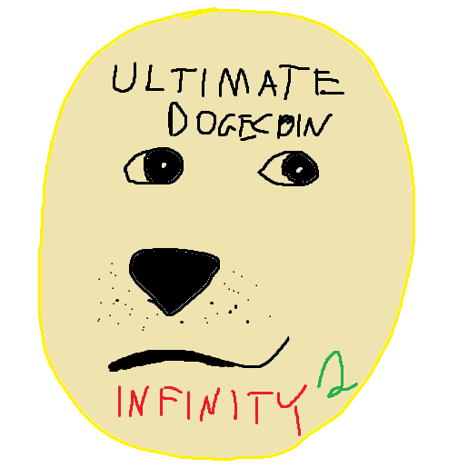

# Ethereum: Auction platform

Student project for blockchain fundamentals course.

## Project overview

-   This project is an implementation of Vickrey auction on Ethereum blockchain using Solidity.
-   A user is able to create an auction by providing a starting price, two phase deadlines, and description of an item/service to be sold.
-   For a given auction, users are be able to bid by locking their funds (possibly greater than the placed bid) in the contract without revealing their actual bid.
-   After the first deadline users must reveal their bids for them to be considered. Users cannot create new bids now.
-   After the second deadline, respective funds can be withdrawn by the interested parties. Winner (if any) withdraws the difference between their bid and the second price, while the auction creator withdraws the second price.

Full description of the project can be found here: [Documentation (PL)](Dokumentacja.md).

## First time setup

1. Install `node`, `npm` and `ganache`.
1. Add `MetaMask` to [chrome](https://chrome.google.com/webstore/detail/metamask/nkbihfbeogaeaoehlefnkodbefgpgknn) or [firefox](https://addons.mozilla.org/en-US/firefox/addon/ether-metamask/).
1. Run `npm install`.
1. Run `Ganache` and perform first time setup.
1. Connect `MetaMask` to your `Ganache` account of choice.
1. Link this project to Ganache workspace (in Ganache: settings -> workspace -> ADD PROJECT -> select truffle-config.js)
1. Run `npm run deploy` in cloned directory.

## Setup

1. Ensure that `Ganache` is running.
1. Run `npm run dev` in cloned directory.
1. Go to [localhost:3000](http://localhost:3000/).

## Authors

-   [Wojciech Buczek](https://github.com/Wowol)
-   [Krzysztof Pióro](https://github.com/krzysztofpioro)
-   [Marcin Serwin](https://github.com/marcin-serwin)

## Licenses and acknowledgments

Project code is distributed under the [GPL3 License](https://www.gnu.org/licenses/gpl-3.0.html). See [LICENSE](LICENSE) for more information.

Ultimate Dogecoin Infinity 2 logo and all other images are distributed under [CC BY-SA 2.5](https://creativecommons.org/licenses/by-sa/2.5/).
